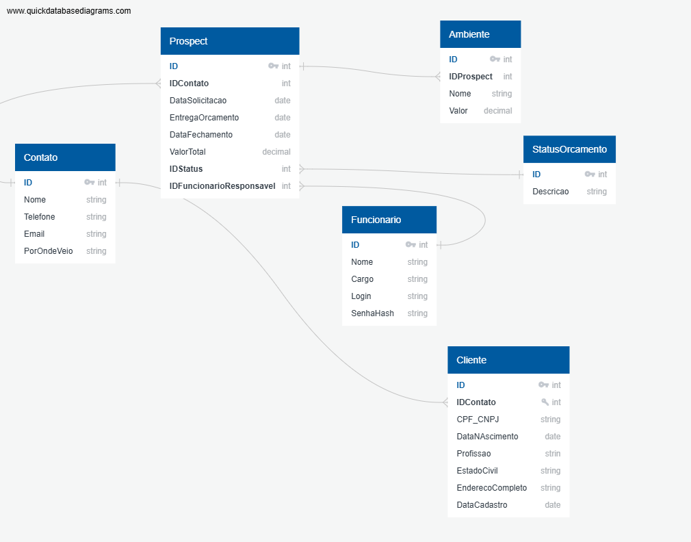

# 🪚 Projeto: Modelo Marcenaria

Este é o meu projeto de modelagem de dados focado em uma Marcenaria - móveis sob medida. Estou desenvolvendo este projeto para aplicar na prática o que estou aprendendo a minha graduação em Análise e Desenvolvimento de Sistema e no curso da TOTVS (Engenharia de Dados e ML) da DIO.

### 🎯 O que eu quis resolver?

Minha ideia foi organizar o fluxo de uma marcenaria real para utilizar o que estou aprendendo com um projeto para empresa familiar, assim consolido os fundamentos da tecnologia e agrego valor e maior funcionalidade a empresa. Para este projeto, optamos pela estratégia de **MVP (Mínimo Produto Viável)**. O objetivo é entregar um banco de dados funcional focando no cadastro de clientes e orçamentos para depois evoluir com controle de estoque, fornecedores...

### 🛠️ Ferramentas utilizadas até o momento

* **QuickDBD:** Para desenhar o diagrama (DER).
* **VS Code:** Onde organizo meus arquivos de estudo.

### 🧠 Como o sistema funciona (Regras que definimos)

Pensei em algumas regras importantes para os dados não ficarem bagunçados:

* **Organização:** Usei chaves (PK e FK) para que nenhum pedido fique "solto" no sistema.
* **Fluxo de Venda:** Um contato só vira cliente quando fecha o negócio.
* **Relacionamento:** Um contato é de apenas um cliente, mas esse cliente pode fazer vários orçamentos e móveis diferentes comigo.

---

