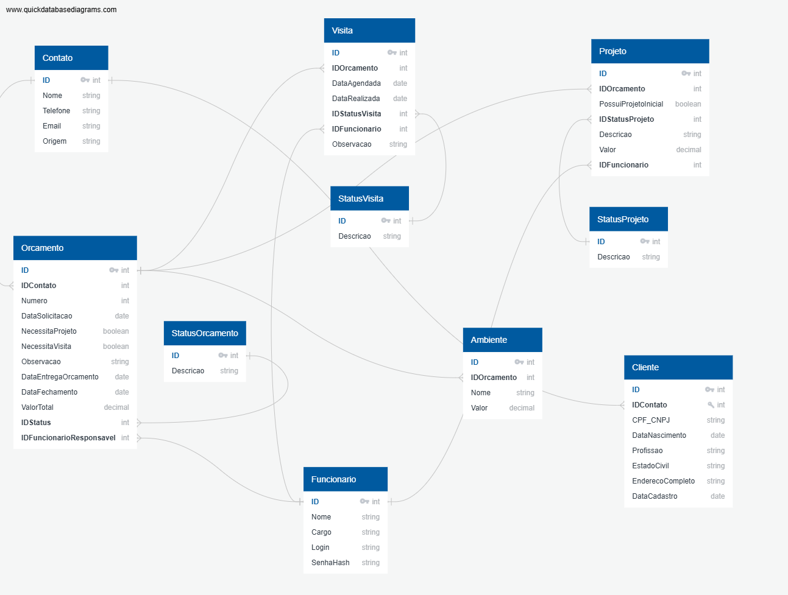

# 🪚 Modelo Movelaria

Sistema web de gestão comercial para movelarias de móveis sob medida. Ele organiza o fluxo de vendas desde o
primeiro contato até o fechamento do orçamento e o cadastro do cliente.

Foi desenvolvido a partir do cenário real de uma empresa familiar, aplicando conhecimentos da graduação em
Análise e Desenvolvimento de Sistemas e da Mentoria em Testes de Software do Julio de Lima.

---

## 🎯 Objetivos

1. **Organizar o fluxo comercial da movelaria**:
   **Prospecção → Contato → Briefing/Orçamento → Visita/Projeto → Cliente**
2. **Servir de laboratório de testes de software**: um sistema completo (frontend, API REST e banco de dados)
   para ser testado pelo QA. Ele permite praticar testes
   funcionais, exploratórios, de API, de banco de dados, de segurança e de regressão.
3. **Uso real**: depois de validado pelos testes, o sistema poderá ser usado no dia a dia das empresas.
   
---

## 🧩 Funcionalidades

| Tela | O que faz |
|---|---|
| **Login** (`index.html`) | Autenticação por usuário e senha (JWT). |
| **Início** (`dashboard.html`) | Indicadores do mês (orçamentos em aberto, fechados, perdidos, clientes, conversão de prospecção) e agenda de próximos contatos e visitas. Filtro por empresa. |
| **Prospecção** (`prospeccao.html`) | Busca ativa de clientes pelo vendedor, por empresa (Em andamento, Perdido, Convertido). O botão ➕📄 gera o orçamento quando o contato aceita a cotação. |
| **Histórico de prospecção** (`historico_prospeccao.html`) | Registro de cada interação (ligação, WhatsApp, visita) e do próximo contato. |
| **Briefing** (`briefing_orcamento.html`) | Cria e edita o orçamento: dados do contato, ambientes com valores, visita técnica, projeto, histórico, anexos (JPG, PNG, PDF) e impressão do orçamento e do contrato (com logo e dados da empresa). Quando vem de uma prospecção, abre já preenchido. |
| **Orçamento** (`orcamento.html`) | Lista os orçamentos e dá acesso à edição. |
| **Cliente** (`cliente.html`) | Lista e completa os dados de quem fechou orçamento (CPF/CNPJ, RG, endereço etc.). |
| **Funcionários** (`funcionarios.html`) | Somente administrador: cadastro, edição, redefinição de senha e inativação. |

### Perfis de acesso

- **Administrador**: acesso total, incluindo a tela Funcionários.
- **Funcionário**: acesso às telas comerciais; não gerencia usuários.

---

## 🧠 Regras de negócio

**Prospecção → Orçamento → Cliente**

- **Prospecção** é a busca ativa do vendedor por novos clientes. Toda prospecção pertence a uma empresa e a um vendedor.
- A prospecção só vira **orçamento** quando a pessoa aceita e envia as informações para cotação. O orçamento é
  gerado pela própria prospecção (botão ➕📄), que passa automaticamente para **Convertido** e fica vinculada a ele.
- O status **Convertido** não pode ser escolhido à mão, cada prospecção gera no máximo um orçamento e, depois de
  convertida, o status não muda mais.
- Um contato só se torna **cliente** quando **fecha o serviço** (orçamento com status Fechado).
- Um cliente pode ter vários orçamentos.
- Um orçamento pertence a uma empresa (Apparato ou Signore) e recebe numeração própria (ex.: `APPARATO-2026-0001`).
- Um orçamento contém um ou mais **ambientes** (ex.: cozinha, sala); o valor total é a soma dos ambientes.
- Um orçamento pode exigir **visita técnica** e **projeto**, cada um com seu próprio status.
- A data de fechamento não pode ser anterior à data de solicitação.
- Todas as interações ficam registradas em histórico (do orçamento e da prospecção).
- Senhas são guardadas apenas como hash (bcrypt) e não podem ser consultadas, apenas redefinidas.
- Os dados da empresa impressos no contrato vêm do banco e só o administrador pode alterá-los.
- Um funcionário com orçamentos vinculados não pode ser excluído, apenas inativado.

As regras e os códigos HTTP de cada endpoint estão detalhados em
`modelo_movelaria_API/resources/business_rules.md`.

---

## 🏗️ Arquitetura

O sistema é formado por dois projetos independentes, cada um com seu repositório:

| Projeto | Repositório | Responsabilidade |
|---|---|---|
| **Frontend** (este) | [modelo_movelaria](https://github.com/CibeleFalaschi/modelo_movelaria) | Telas em HTML, CSS e JavaScript puro, sem etapa de build. |
| **Backend** | [modelo_movelaria_API](https://github.com/CibeleFalaschi/modelo_movelaria_API) | API REST em Node.js/Express: login, regras de negócio, validações, uploads e acesso ao banco. |

```text
Navegador ──HTTP/JSON──▶ API (Node.js, porta 3000) ──▶ MySQL (banco modelo_movelaria)
   ▲
   └── arquivos estáticos do frontend (porta 5500, ou servidos pela própria API)
```

O frontend é **estático**: os arquivos são entregues como estão, sem processamento no servidor. Os dados são
carregados em tempo de execução a partir da API. O frontend nunca acessa o banco diretamente.

### Tecnologias

- **Frontend:** HTML5, CSS3, JavaScript (ES Modules)
- **Backend:** Node.js 18+, Express, JWT, bcrypt, Multer, Swagger
- **Banco de dados:** MySQL 8
- **Modelagem:** QuickDBD

---

## ▶️ Como executar

### Pré-requisitos

- [Node.js](https://nodejs.org/) 18 ou superior
- MySQL 8
- Python 3 (apenas para servir o frontend em desenvolvimento; qualquer servidor HTTP serve)
- As duas pastas lado a lado:

```text
CIBELE/
├── modelo_movelaria/       # frontend (este projeto)
└── modelo_movelaria_API/   # backend
```

### 1. Criar o banco de dados

Execute o schema oficial, que fica na API (este repositório guarda uma cópia idêntica):

```bash
mysql -u SEU_USUARIO -p < ../modelo_movelaria_API/resources/banco_movelaria.sql
```

O script cria o banco `modelo_movelaria`, os status padrão e as empresas Apparato e Signore.

> ⚠️ Use sempre um banco novo. O script não apaga tabelas existentes. Se o seu banco foi criado antes de
> 05/10/2026, execute também `../modelo_movelaria_API/resources/migracoes/2026-10-05_dados_empresa_e_prospeccao.sql`.

### 1.1 Cadastrar os dados reais das empresas

Endereço, telefone, e-mails, CNPJ e responsável aparecem no contrato, mas **não ficam no código** (este repositório é
público). Eles ficam só no banco:

1. Na pasta da API, copie `resources/empresas.exemplo.sql` para `resources/empresas.local.sql`.
2. Preencha os dados de cada empresa. Campo sem valor (`NULL`) sai no contrato como linha em branco.
3. Execute: `mysql -u SEU_USUARIO -p modelo_movelaria < resources/empresas.local.sql`

Arquivos `*.local.sql` são ignorados pelo Git e nunca são publicados.

### 2. Configurar e iniciar a API

Na pasta `modelo_movelaria_API`:

1. Copie `.env.example` para `.env` e preencha:
   - `DB_HOST`, `DB_PORT`, `DB_USER`, `DB_PASSWORD`, `DB_NAME=modelo_movelaria`
   - `JWT_SECRET`: um texto longo e aleatório (obrigatório)
   - `FRONTEND_URL=http://localhost:5500,http://127.0.0.1:5500`
   - `ADMIN_NAME`, `ADMIN_LOGIN`, `ADMIN_PASSWORD`: dados do primeiro administrador
2. Instale as dependências, crie o administrador e inicie:

```bash
npm install
npm run create-admin
npm start
```

Para conferir se a API está no ar e conectada ao banco: `http://localhost:3000/api/health` deve retornar
`"database": "ok"`.

### 3. Iniciar o frontend

Na pasta `modelo_movelaria`:

```bash
python -m http.server 5500
```

Acesse `http://localhost:5500/index.html` e entre com o `ADMIN_LOGIN` e o `ADMIN_PASSWORD` definidos no `.env`.

> **Alternativa com uma URL só:** defina `FRONTEND_DIR=../modelo_movelaria` no `.env` da API e acesse
> `http://localhost:3000`. A própria API passa a servir as telas.

### Endereço da API

O frontend detecta o endereço automaticamente em [js/config.js](js/config.js):

- em `localhost` ou `127.0.0.1`, usa `http://localhost:3000/api`;
- em outro domínio, usa `/api` no mesmo domínio.

Para apontar para outra API, defina antes dos scripts:

```html
<script>window.MOVELARIA_CONFIG = { API_BASE: 'https://api.seu-dominio.com/api' };</script>
```

---

## 🧪 Testes

### Para quem vai testar (QA)

- **Documentação da API (Swagger):** `http://localhost:3000/api-docs`
- **Regras de negócio e status HTTP:** `modelo_movelaria_API/resources/business_rules.md`
- **Health check:** `GET /api/health` informa se o servidor e o banco estão disponíveis.

Recomenda-se testar em um banco separado (ex.: `modelo_movelaria_teste`, definido em `DB_NAME`) para não
misturar dados de teste com dados reais.

### Verificação antes da entrega para testes

Antes da liberação para o QA, foi executado um teste de fumaça (smoke test) de ponta a ponta, em banco limpo:

- **API (47 verificações):** login válido e inválido, rotas sem token (401), permissões de funcionário (403),
  login duplicado (409), criação e edição de funcionário, briefing completo com ambientes, visita e projeto,
  edição sem duplicar registros, fechamento do orçamento gerando cliente, edição de cliente, upload e download
  de anexo, bloqueio de arquivo `.exe`, prospecção com empresa, histórico, conversão de prospecção em orçamento
  (incluindo bloqueio de conversão manual e de segundo orçamento) e dados de contrato da empresa.
- **Navegador (Chrome):** login pela tela, abertura de todas as telas sem erros de JavaScript, criação de
  prospecção, geração do orçamento a partir dela e impressão do contrato das duas empresas.

---

## 📊 Banco de dados



Entidades: Contato, Empresa, Funcionário, Prospecção, Histórico de Prospecção, Orçamento, Ambiente, Visita,
Projeto, Histórico do Orçamento, Cliente, Endereço, Arquivo e Status (Orçamento, Visita e Projeto).

> O diagrama pode não refletir 100% a versão atual. O schema executável e suas constraints estão em
> [banco_movelaria.sql](banco_movelaria.sql). A fonte oficial é `modelo_movelaria_API/resources/banco_movelaria.sql`:
> altere primeiro na API e copie para cá.

---

## 📁 Estrutura do projeto

```text
modelo_movelaria/
├── index.html                 # login
├── dashboard.html             # início / indicadores
├── prospeccao.html
├── historico_prospeccao.html
├── briefing_orcamento.html
├── orcamento.html
├── cliente.html
├── funcionarios.html
├── css/                       # estilos por tela
├── js/
│   ├── config.js              # endereço da API
│   ├── api.js                 # chamadas HTTP e token JWT
│   ├── api-bridge.js          # expõe a API às telas e controla sessão/perfil
│   ├── script.js              # utilitários (moeda, datas, alertas)
│   └── <tela>.js              # lógica de cada tela
├── imagens/
└── banco_movelaria.sql        # cópia do schema oficial
```

---

## 🚀 Uso em produção

Antes de usar com dados reais:

- Publique frontend e API somente com **HTTPS**.
- Configure `FRONTEND_URL` na API com o domínio real do frontend (CORS).
- Use um `JWT_SECRET` forte e exclusivo do ambiente de produção.
- Use um usuário de banco com permissões mínimas, nunca o `root`.
- Faça **backup** periódico do banco **e** da pasta `uploads/` da API (anexos do briefing).

---

## 🔭 Próximos passos

- Testes automatizados (API e interface).
- Limite de tentativas de login.
- Migrações de banco versionadas.
- Atualizar o diagrama do banco.
